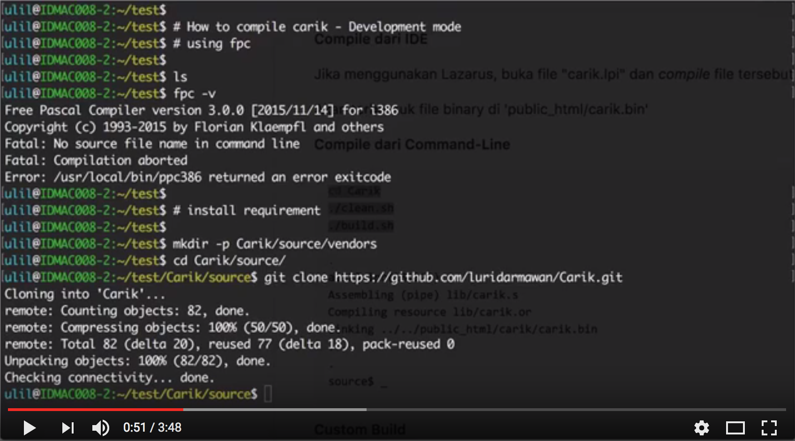

# Carik - Pencatat Diskusi Online

## What is it?

**Carik** merupakan bot sederhana yang digunakan unt merekam pembicaraan di suatu group telegram.

Carik juga memiliki fitur sebagai penjawab pesan sederhana, menanyakan hal-hal yang telah didefinisikan sebelumnya oleh system.
Walaupun emiliki fitur menjawab otomatis, dan belajar suatu definisi kata sederhana.
Kecerdasan Bot ini tergantung dari data *entity* dan *intent* yang Anda miliki, serta logic handler yang Anda buat.

Contoh penggunaan bot sederhana dengan SimpleBOT ini bisa anda coba dari situs [bot.fastplaz.com](http://bot.fastplaz.com) atau bisa melalu aplikasi chat **Telegram**, silahkan hubungi contact *'Fastplaz Bot'*.


## Why use it?

**Ringan Tanpa Beban**

**Carik** merupakan turunan dari [SimpleBOT](https://github.com/luridarmawan/SimpleBOT), yang menggunakan kecerdasan buatan yang sederhana dari [SimpleAI](https://github.com/luridarmawan/SimpleAI).

Dibuat dengan sederhana, simple dan ringan. SimpleBOT sendiri adalah _binary application_ sehingga diharapkan akan lebih cepat dan ringan. 

Kompatibel dengan shared hosting umumnya.

Untuk penggunaan custom, cukup dibutuhkan instalasi Apache Web Server regular.


## How to use it


### Requirements

- [FastPlaz_runtime](http://www.fastplaz.com/)
- [SimpleBOT package](https://github.com/luridarmawan/SimpleAI/)

### Instalasi

**install requirement**

```bash
$ mkdir -p Carik/source/vendors
$ cd Carik/source
$ git clone https://github.com/luridarmawan/Carik.git

# change to branch development

# install vendors
#   change to branch development if needed

$ cd vendors
$ git clone https://github.com/fastplaz/fastplaz.git
$ git clone https://github.com/luridarmawan/SimpleAI.git


```

**Compile dari IDE**

Jika menggunakan Lazarus, buka file "carik.lpi" dan *compile* file tersebut.

Akan terbentuk file binary di 'public_html/carik.bin'

**Compile dari Command-Line**

```bash
cd Carik
./clean.sh
./build.sh
.
.
ai123.lpr(13,124)
Assembling (pipe) lib/carik.s
Compiling resource lib/carik.or
Linking ../../public_html/carik/carik.bin
.
.
source$ _

```

**Custom Build**

untuk konfigurasi custom, misal untuk perubahan path tempat library berada, bisa dilakukan dengan melakukan modifikasi di file **extra.cfg**.

**Telegram Bot Installation**

Cara instalasi bot telegram bisa anda ikuti dari situs offisial dari telegram.


## Carik USAGE

Pada dasarnya, Carik bertindak seperti bot pada umumnya, fitur yang ada di SimpleBot ada pula di Carik. Cukup tanyakan kepadanya hal2 tertentu, dia akan menjawabnya, tentu saja selama data-2 pertanyaan sudah dia miliki sebelumnya.

Beberapa hal yang bisa ditanyakan:

- greeting
- jam/hari/bulan saat ini
   * ```sekarang jam berapa```
   * ```hari apa sekarang```
- jadwal sholat
   * ```jadwal sholat```
   * ```jadwal sholat semarang```
- whois domain
   * ```whois fastplaz.com```
   * ```whois pandi.id lengkap```
- perhitungan angka
   * ```berapa 1+1*5```
   * ```hitung sin(10)/2```
- arti kata
   * ```artinya kehidupan```
- cek resi pengiriman paket dari kurir: jne, tiki, pos, pandu, jnt, sicepat dan wahana
   * ```format: resi [kurir] [koderesi]```
   * ```cek resi jno 12345678```
- info film
   * ```cari info film ada dengan cinta```
- kurs
   * ```1 usd berapa idr```


**beberapa fitur becanda:**

- cek jadwal
- beli pulsa

Khusus untuk merekam diskusi, Anda cukup memberikan perintah:

```
@bot catat diskusi
```
beberapa kalimat yang bisa digunakan:

- @bot catat notulen
- @CarikBot rekam obrolan
- @CarikBot mulai rekaman

bisa langsung dimention, atau dengan me-reply comment bot sebelumnya.

## Video Compilasi Source

[](https://www.youtube.com/watch?v=m8n4qijbcGM)

